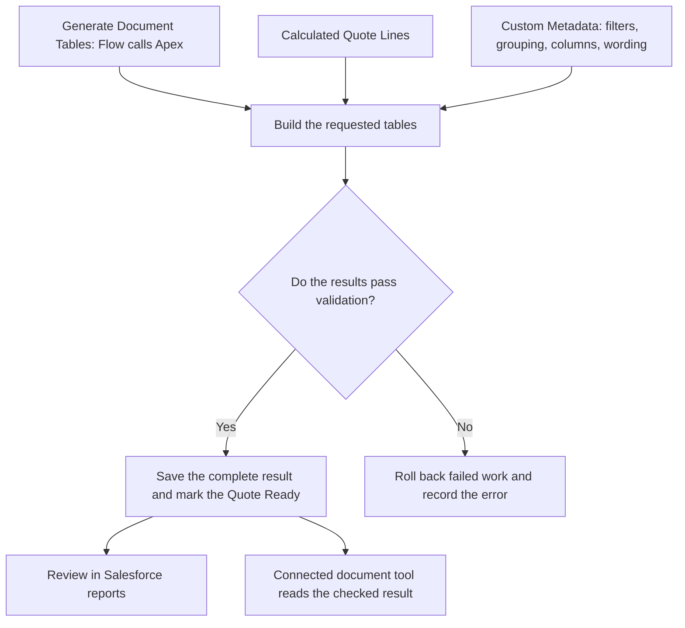

# Quote Document Totals for Salesforce CPQ

**Build and check customer document tables from Salesforce CPQ Quote Lines.**

A customer may need a summary by product family, a payment schedule, or a separate list of optional products. Quote Document Totals builds these tables from a priced Quote and saves them in Salesforce. You can review the rows and totals before your document tool uses them in a proposal or order form.

**[Explore use cases](docs/use-case/README.md)** · **[Find your scenario](#find-your-scenario)** · **[See an example](#a-concrete-example)** · **[Quick start](docs/quick-start.md)** · **[Documentation](docs/README.md)**

Salesforce CPQ (Configure, Price, Quote) calculates the prices. This project prepares and checks the data for proposals and order forms. Creating a PDF, sending a document, and collecting signatures require a separate document tool and integration.

> **Status: Active development.** Start in a Salesforce CPQ sandbox or disposable test org. Updates may break existing setups; validate your use cases before production use.

## What makes this project useful

If several document templates use the same Quote data, maintaining filters and totals in each template takes time. This project lets you keep those rules in Salesforce and reuse the saved results.

- Create a product-family summary, bundle details, and optional-product list from the same Quote. Choose the lines, grouping, and columns for each table.
- Change labels, filters, display order, and wording through Custom Metadata. These are configuration records in Salesforce Setup. New business rules may still need Flow or Apex code.
- Check totals before creating a document. The project checks which rows contribute to each total and compares payable tables with the CPQ Quote amount.
- Include only the sections the Quote needs. For example, an order form can omit Hardware when there are no matching lines. Follow the [dynamic order-form guide](docs/dynamic-order-form-composition.md) to configure sections and notes.
- Review saved tables, rows, and text in Salesforce related lists and reports. Generation status shows whether the result is ready or needs attention.

## Find your scenario

Start with the customer question you need the document to answer. These guides include Salesforce setup steps, worked examples, checks, and troubleshooting.

| Customer question or requirement                        | Start with                                                                                                                                 | What is included                                                 |
| ------------------------------------------------------- | ------------------------------------------------------------------------------------------------------------------------------------------ | ---------------------------------------------------------------- |
| A short summary by product family                       | [Product Family Summary](docs/use-case/01-product-family-summary.md)                                                                       | Active table definition; a good first example                    |
| One-time and recurring charges separately               | [Charge Type Summary](docs/use-case/02-charge-type-summary.md)                                                                             | Active table definition                                          |
| A package and the products inside it                    | [Bundle Detail](docs/use-case/04-bundle-detail.md)                                                                                         | Active table definition                                          |
| Optional add-ons kept separate from the purchase total  | [Optional Products](docs/use-case/07-optional-products.md)                                                                                 | Active table definition                                          |
| Prices broken down by month or year                     | [Monthly Breakdown](docs/use-case/08-monthly-subscription-breakdown.md) · [Multi-Year Schedule](docs/use-case/09-multi-year-schedule.md)   | Inactive examples to configure and test                          |
| Payments at signing, delivery, and acceptance           | [Payment Installments](docs/use-case/10-payment-installments.md)                                                                           | Schedule records included; table setup required                  |
| Costs divided among departments or locations            | [Cost Allocation](docs/use-case/15-cost-allocation.md)                                                                                     | Allocation support included; table setup required                |
| Basic, recommended, and premium options                 | [Alternative Proposals](docs/use-case/27-alternative-proposals.md)                                                                         | Separate-table support included; option and table setup required |
| What changed in an amendment or renewal                 | [Amendment Before-and-After](docs/use-case/17-amendment-before-after.md) · [Renewal Schedule](docs/use-case/18-renewal-coterm-schedule.md) | Provisional; validate with real CPQ amendment or renewal data    |
| An order form with only the relevant sections and notes | [Dynamic Order Form](docs/dynamic-order-form-composition.md)                                                                               | Configuration walkthrough                                        |

**[All 43 use-case guides and 57 additional design patterns](docs/use-case/README.md)**

The catalog also covers discounts, usage tiers, customer product numbers, translated labels, and document text. Each guide lists the included records, required setup, and checks to run. Test active definitions in your sandbox too. The additional design patterns describe possible configurations; they are not installed features.

## A concrete example

A Quote contains Software and Services products, plus an optional $2,000 training add-on. The customer needs a short summary of the committed purchase. The Product Family Summary groups the included lines and excludes the optional add-on:

| Product Family | List amount | Discount | Net amount |
| -------------- | ----------: | -------: | ---------: |
| Software       |     $12,000 |   $1,200 |    $10,800 |
| Services       |      $5,000 |       $0 |     $5,000 |
| Grand Total    |     $17,000 |   $1,200 |    $15,800 |

The expected net total is **$15,800**, with the optional $2,000 kept separate. The same Quote can also produce an Optional Products table without adding those options to the committed purchase.

These are illustrative values from the [worked example](docs/use-case/01-product-family-summary.md), not a screenshot or a recorded test run. The installation does not create this Quote automatically.

## How it works

**Priced Quote → Generate Document Tables → Review saved summaries → Create a document with your connected tool**

The Quote supplies the values, and Custom Metadata defines how to organize them. A Flow starts generation. The included Apex code builds the tables and checks the result. Apex is the programming language used for this work in Salesforce.



For the Product Family Summary above, the settings tell Apex to exclude optional lines, group the remaining lines by Product Family, and show list, discount, and net amounts. Other definitions can organize the same Quote into different tables.

The saved result contains **Tables** for document sections, **Columns** for headings and field selection, **Rows** for details and totals, and **Blocks** for document text. A successful Quote is **Ready**, and each generated table is **Complete**. A failed validation leaves an error to correct; a partial result must not be used for a customer document.

After relevant Quote changes, generate again. Correct the Quote or its settings rather than editing saved output. A document tool uses the checked values and handles the final layout and delivery.

Read **[How Quote Document Totals works](docs/how-quote-document-totals-works.md)** for the Salesforce walkthrough, status meanings, configuration, and troubleshooting. See **[Architecture and Flow diagrams](docs/use-case/architecture-and-flow.md)** for the saved data model and generation flow, or use the **[quick start](docs/quick-start.md)** to try it.

## Choose your next step

| Task                                              | Read this                                                                               |
| ------------------------------------------------- | --------------------------------------------------------------------------------------- |
| Install and generate your first table             | [Quick start](docs/quick-start.md)                                                      |
| Understand the process before changing Salesforce | [How Quote Document Totals works](docs/how-quote-document-totals-works.md)              |
| Configure fields, rules, access, and checks       | [Configuration and maintenance guide](docs/quote-document-totals-architecture-guide.md) |
| Find another guide                                | [Documentation home](docs/README.md)                                                    |
| See what is still planned                         | [Roadmap](docs/roadmap.md)                                                              |

For installation planning and ongoing support, see [install, upgrade, and removal](docs/install-upgrade-removal.md), [access roles](docs/access-model.md), and [configuration diagnostics](docs/configuration-diagnostics.md). Release owners can use the [license and support decisions](docs/governance-decision-record.md) and [publication checklist](docs/github-publication-checklist.md).

## Before you install

You need:

- A Salesforce org with **Salesforce CPQ** installed and configured. This project uses the `SBQQ__` objects and fields supplied by Salesforce CPQ.
- Salesforce CLI (`sf`).
- Git to download the source.
- Permission to deploy Salesforce metadata and assign permission sets.
- A test org or sandbox for the first installation.

The project uses Salesforce API version 67.0; the target org must support it. It does not install Salesforce CPQ. An ordinary Developer Edition or Trailhead Playground without CPQ is not sufficient. Installation deploys source from this repository; there is no one-click package installer in this guide.

## Install in a test org

```bash
git clone https://github.com/gkolan/quote-document-totals.git
cd quote-document-totals
sf org login web --instance-url https://test.salesforce.com --alias qdt-test
npm run preflight:install -- --target-org qdt-test --output artifacts/install-preflight.json
sf project deploy start --target-org qdt-test --source-dir force-app --wait 30
sf org assign permset --target-org qdt-test --name CPQ_Document_Totals_Generator
```

These commands use a sandbox login. For another CPQ test org, use its login URL as described in the [quick start](docs/quick-start.md). Wait for deployment to succeed before assigning access.

Next, follow the [quick start](docs/quick-start.md#3-add-the-action-and-review-fields) to add the Quote action and **Document Tables** related list, generate your first table, and check the report. The active Custom Metadata records decide which tables Salesforce creates.

## Scope and current status

The repository includes a Quote action and Flow, Apex generation and tests, Custom Metadata, generated-record objects, separate access roles, and review reports. Installation deploys Salesforce source; the Quote action generates document data. It does not install CPQ or provide a complete DocuSign CLM integration.

A connected document tool must use the saved values and handle layout and delivery. It should not calculate pricing or totals again. Without a CPQ org, you can explore the examples and source and run the local checks below.

Test with your own products, pricing rules, and document tool before production use. Some advanced Quote-change examples need validation against real amendment and renewal data. Report links open saved Salesforce reports; one-click Quote filtering is still planned where a guide says so.

## Design challenges and decisions

| Challenge                                                             | How the project addresses it                                                                                                                                                       |
| --------------------------------------------------------------------- | ---------------------------------------------------------------------------------------------------------------------------------------------------------------------------------- |
| One Quote needs several different summaries                           | Table definitions separate line selection, grouping, columns, and display order. Common changes use Custom Metadata instead of a new Apex implementation.                          |
| Detail rows, subtotals, and optional items can be counted incorrectly | Row roles and inclusion rules distinguish contributions from calculated totals. Verification reconciles rows and totals, with comparison to the CPQ Quote amount where applicable. |
| A failure could leave only part of a document's data updated          | Generation saves the result together and rolls back failed work. A partial result must not become Ready.                                                                           |
| Saved output can become outdated or be changed after generation       | Input change checks and saved-output integrity checks determine whether an existing result can be reused. Document reads validate the expected generation identity.                |
| Two requests can try to generate the same Quote                       | Generation ownership checks reject competing or superseded requests, with handling for abandoned work.                                                                             |
| Different document tools could interpret the same Quote differently   | Salesforce saves ordered content and exposes a shared read service. Each integration is responsible for formatting and delivery using that result.                                 |

Saving document records makes the result reviewable, but adds storage, permissions, and regeneration responsibilities. Configurable rules cover supported cases; new business behavior can still require Apex and additional tests. These are design choices implemented in source, not a claim that every CPQ configuration has been verified.

### Run the document example locally

You can validate a complete sample payload and render a deterministic HTML document without a Salesforce org:

```bash
npm ci
npm run test:renderer-contract
npm run render:reference-document -- --input contracts/v2/fixtures/valid/mixed.json --output-dir artifacts/reference-document --expected-request-id REQ-MIXED-001 --expected-fingerprint fixture-mixed-v1
```

Open `artifacts/reference-document/quote-document.html`. It contains tables and content blocks from the checked fixture. The accompanying manifest records the input and output hashes. Read the [document contract and reference output guide](docs/document-integration-contract.md) for the data contract, expected values, and current limits.

After deploying to a CPQ test org, the [live document export guide](docs/document-integration-contract.md#export-a-live-generated-document) uses the supplied read-only REST endpoint to retrieve the exact generated result, validate it, and render the same HTML example. Live payloads stay under the ignored `artifacts/` directory.

## Explore the implementation

Start with the [architecture view](docs/use-case/architecture-and-flow.md), then follow these parts of the source:

| Area                                      | Code and supporting tests                                                                                                                                                                                                                                                  |
| ----------------------------------------- | -------------------------------------------------------------------------------------------------------------------------------------------------------------------------------------------------------------------------------------------------------------------------- |
| Building and saving a complete result     | [QuoteDocumentGenerator](force-app/main/default/classes/QuoteDocumentGenerator.cls) and [failure-boundary tests](force-app/main/default/classes/QuoteDocumentFailureBoundaryTest.cls)                                                                                      |
| Reconciling rows and totals               | [QuoteDocumentVerification](force-app/main/default/classes/QuoteDocumentVerification.cls) and [aggregation tests](force-app/main/default/classes/QuoteDocumentAggregationTest.cls)                                                                                         |
| Managing overlapping requests             | [QuoteDocumentLifecycle](force-app/main/default/classes/QuoteDocumentLifecycle.cls) and [concurrency tests](force-app/main/default/classes/QuoteDocumentLifecycleConcurrencyTest.cls)                                                                                      |
| Reading the checked result for a document | [QuoteDocumentRestResource](force-app/main/default/classes/QuoteDocumentRestResource.cls), [QuoteDocumentRenderService](force-app/main/default/classes/QuoteDocumentRenderService.cls), and [REST tests](force-app/main/default/classes/QuoteDocumentRestResourceTest.cls) |

The linked tests show the cases covered in source. Run the Salesforce checks in your own CPQ test org before relying on the results.

## Test the project

The checks that do not require a Salesforce org run with Node.js 20:

```bash
npm ci
npm run audit:dependencies
npm test
npm run lint
npm run prettier:verify
npm run test:docs
npm run test:ci-gate
npm run ci:contributor-versions
```

GitHub Actions runs local project checks on pull requests and pushes to `main`. It does not deploy to Salesforce or run Apex tests. `npm run audit:dependencies` rejects high or critical dependency findings. `npm test` currently skips LWC tests because no LWC test files are present. `npm run test:ci-gate` tests release tooling, permission boundaries, contributor version checks, publication hygiene, the exact Salesforce manifest, and the protected validation command; it then checks the current tracked files and all 525 non-test metadata components.

Apex tests and a Salesforce deployment check require a Salesforce CPQ test org. See the [testing guide](docs/testing-guide.md) for release verification. The optional [demo bootstrap script](scripts/scratch-org-bootstrap.sh) requires Bash and a disposable CPQ test org; it creates and replaces sample data. Use the quick start for your first installation.

## Contributing and support

- Read [CONTRIBUTING.md](CONTRIBUTING.md) before proposing a change.
- Use [SUPPORT.md](SUPPORT.md) and the structured issue forms for public support requests.
- Report a security concern using [SECURITY.md](SECURITY.md).
- Use the pull request template and state which Salesforce org checks were completed.

No open-source license has been selected yet. Until the repository owner adds one, the source is available for review but no reuse rights are granted.
