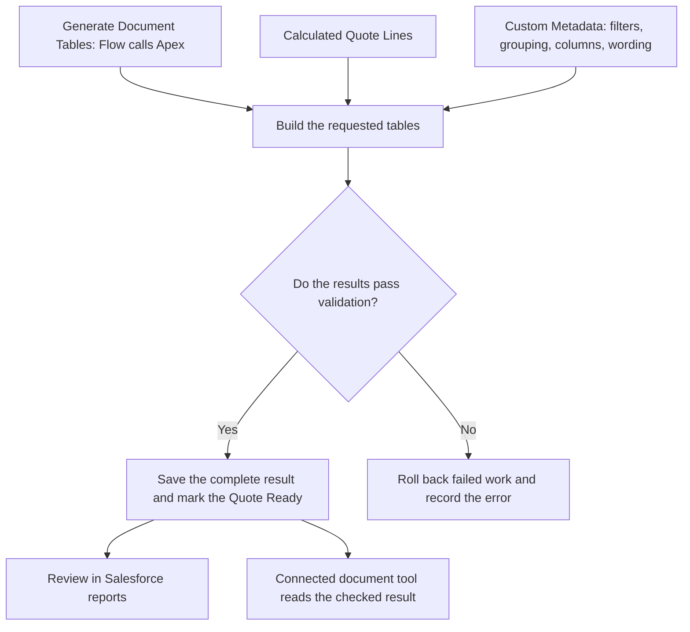

# Quote Document Totals for Salesforce CPQ

**Turn Salesforce quote line items into checked summaries for proposals and order forms.**

A priced Quote still needs a readable customer summary. This project groups products, separates optional items, and checks totals in Salesforce, so each document template does not have to repeat those rules.

**Priced Quote → Generate Document Tables → Review saved summaries → Create a document with your connected tool**

**[Quick start](docs/quick-start.md)** · **[See an example](#a-concrete-example)** · **[How it works](docs/how-quote-document-totals-works.md)** · **[Explore the code](#explore-the-implementation)**

Requires a Salesforce CPQ test org. Produces document data; connect a document tool separately to create the final file.

> **Status: Active development.** Updates may break existing setups, and bugs or incomplete behavior are possible. Try it in a sandbox or disposable CPQ test org and validate your use cases before production use.

## Why this project exists

Salesforce CPQ (Configure, Price, Quote) holds the products, quantities, discounts, and calculated prices for a deal. Customer documents need those values arranged into summaries, bundle details, optional items, or schedules.

Getting the price right is only part of preparing a customer document. The document also has to answer questions such as:

- How much is the customer buying in each product family?
- Which charges recur, and which are one-time?
- Which products belong to a bundle?
- Which items are optional and must stay out of the payable total?
- Do the displayed subtotals agree with the underlying Quote Lines?

When each document template defines its own grouping, filters, and totals, those rules can be duplicated across templates. A change then requires checking every affected template, and a mismatched number can be difficult to trace back to Salesforce.

**The goal is to define and check the document's data in Salesforce, then let the document tool handle presentation.** A saved table can be inspected before it reaches a customer. Its grouping, labels, and amounts have an explicit source that can be configured and tested.

This is useful when a Quote needs several commercial views of the same line items, or when document rules need to be maintained separately from document layout.

## A concrete example

A Quote contains Software and Services products, plus an optional $2,000 training add-on. The customer needs a short summary of the committed purchase. The Product Family Summary groups the included lines and excludes the optional add-on:

| Product Family | List amount | Discount | Net amount |
| -------------- | ----------: | -------: | ---------: |
| Software       |     $12,000 |   $1,200 |    $10,800 |
| Services       |      $5,000 |       $0 |     $5,000 |
| Grand Total    |     $17,000 |   $1,200 |    $15,800 |

The expected net total is **$15,800**, with the optional $2,000 kept separate. The same Quote can also produce an Optional Products table without adding those options to the committed purchase.

These are illustrative values from the [worked example](docs/use-case/01-product-family-summary.md), not a screenshot or a recorded test run. The installation does not create this Quote automatically.

## How it works

**The Quote supplies the values. Custom Metadata defines how to organize them. Apex builds and checks the result before it is made available for a document.**



For the Product Family Summary above, the settings tell Apex to exclude optional lines, group the remaining lines by Product Family, and show list, discount, and net amounts. Other definitions can organize the same Quote into different tables.

The saved result contains **Tables** for document sections, **Columns** for headings and field selection, **Rows** for details and totals, and **Blocks** for document text. A successful Quote is **Ready**, and each generated table is **Complete**. A failed validation leaves an error to correct; a partial result must not be used for a customer document.

After relevant Quote changes, generate again. Correct the Quote or its settings rather than editing saved output. A document tool uses the checked values and handles the final layout and delivery.

Read **[How Quote Document Totals works](docs/how-quote-document-totals-works.md)** for the Salesforce walkthrough, status meanings, configuration, and troubleshooting. See **[Architecture and Flow diagrams](docs/use-case/architecture-and-flow.md)** for the saved data model and generation flow, or use the **[quick start](docs/quick-start.md)** to try it.

## Design challenges and decisions

| Challenge                                                             | How the project addresses it                                                                                                                                                       |
| --------------------------------------------------------------------- | ---------------------------------------------------------------------------------------------------------------------------------------------------------------------------------- |
| One Quote needs several different summaries                           | Table definitions separate line selection, grouping, columns, and display order. Common changes use Custom Metadata instead of a new Apex implementation.                          |
| Detail rows, subtotals, and optional items can be counted incorrectly | Row roles and inclusion rules distinguish contributions from calculated totals. Verification reconciles rows and totals, with comparison to the CPQ Quote amount where applicable. |
| A failure could leave only part of a document's data updated          | Generation saves the result together and rolls back failed work. A partial result must not become Ready.                                                                           |
| Saved output can become outdated or be changed after generation       | Input change checks and saved-output integrity checks determine whether an existing result can be reused. Document reads validate the expected generation identity.                |
| Two requests can try to generate the same Quote                       | Generation ownership checks reject competing or superseded requests, with handling for abandoned work.                                                                             |
| Different document tools could interpret the same Quote differently   | Salesforce saves ordered content and exposes a shared read service. Each integration is responsible for formatting and delivery using that result.                                 |

Saving document records makes the result reviewable, but adds storage, permissions, and regeneration responsibilities. Configurable rules cover supported cases; new business behavior can still require Apex and additional tests. These are design choices implemented in source, not a claim that every CPQ configuration has been verified.

## Scope and current status

The repository includes a Quote action and Flow, Apex generation and tests, Custom Metadata, generated-record objects, a permission set, and review reports. Table examples cover product families, charge types, bundles, discounts, optional products, schedules, and Quote changes. Some examples ship inactive and require configuration or org-specific validation; check the status in each [use-case guide](docs/use-case/README.md).

Salesforce CPQ remains responsible for commercial pricing. This project prepares document data; it does not install CPQ, provide a complete DocuSign CLM integration, create or send a PDF from the Quote action, or collect signatures. A document tool must be connected separately.

Without a CPQ org, you can review the example, explore the source below, and run local checks. Running the Salesforce feature requires a CPQ test org.

## Before you install

You need:

- A Salesforce org with **Salesforce CPQ** installed and configured. This project uses the `SBQQ__` objects and fields supplied by Salesforce CPQ.
- Salesforce CLI (`sf`).
- Git to download the source.
- Permission to deploy Salesforce metadata and assign permission sets.
- A test org or sandbox for the first installation.

The project uses Salesforce API version 67.0; the target org must support it. It does not install Salesforce CPQ. An ordinary Developer Edition or Trailhead Playground without CPQ is not sufficient. Installation deploys source from this repository; there is no one-click package installer in this guide.

## Install in a test org

```bash
git clone https://github.com/gkolan/quote-document-totals.git
cd quote-document-totals
sf org login web --instance-url https://test.salesforce.com --alias qdt-test
sf project deploy start --target-org qdt-test --source-dir force-app --wait 30
sf org assign permset --target-org qdt-test --name CPQ_Document_Totals
```

These commands use a sandbox login. For another CPQ test org, use its login URL as described in the [quick start](docs/quick-start.md). Wait for deployment to succeed before assigning access.

Next, follow the [quick start](docs/quick-start.md#3-add-the-action-and-review-fields) to add the Quote action and **Document Tables** related list, generate your first table, and check the report. The active Custom Metadata records decide which tables Salesforce creates.

## Start here

- [Quick start](docs/quick-start.md) - installation, first use, expected results, and common problems.
- [Documentation home](docs/README.md) - choose the shortest guide for the task at hand.
- [Available table examples](docs/use-case/README.md) - what ships and what each example shows.
- [Configuration and maintenance guide](docs/quote-document-totals-architecture-guide.md) - fields, settings, access, checks, and support steps.
- [Testing guide](docs/testing-guide.md) - local checks, Salesforce checks, and release evidence.
- [Roadmap](docs/roadmap.md) - work that is not implemented yet.

## Explore the implementation

Start with the [architecture view](docs/use-case/architecture-and-flow.md), then follow these parts of the source:

| Area                                      | Code and supporting tests                                                                                                                                                             |
| ----------------------------------------- | ------------------------------------------------------------------------------------------------------------------------------------------------------------------------------------- |
| Building and saving a complete result     | [QuoteDocumentGenerator](force-app/main/default/classes/QuoteDocumentGenerator.cls) and [failure-boundary tests](force-app/main/default/classes/QuoteDocumentFailureBoundaryTest.cls) |
| Reconciling rows and totals               | [QuoteDocumentVerification](force-app/main/default/classes/QuoteDocumentVerification.cls) and [aggregation tests](force-app/main/default/classes/QuoteDocumentAggregationTest.cls)    |
| Managing overlapping requests             | [QuoteDocumentLifecycle](force-app/main/default/classes/QuoteDocumentLifecycle.cls) and [concurrency tests](force-app/main/default/classes/QuoteDocumentLifecycleConcurrencyTest.cls) |
| Reading the checked result for a document | [QuoteDocumentRenderService](force-app/main/default/classes/QuoteDocumentRenderService.cls) and [integrity tests](force-app/main/default/classes/QuoteDocumentIntegrityTest.cls)      |

These areas demonstrate Salesforce data modeling, configurable behavior, transaction handling, validation, and automated testing. The tests are available for inspection; their presence alone does not establish a successful run in your org.

## Test the project

The checks that do not require a Salesforce org run with Node.js 20:

```bash
npm ci
npm test
npm run lint
npm run prettier:verify
npm run test:docs
npm run test:ci-gate
npm run ci:contributor-versions
```

GitHub Actions runs local project checks on pull requests and pushes to `master`. It does not deploy to Salesforce or run Apex tests. `npm test` currently skips LWC tests because no LWC test files are present; `npm run test:ci-gate` runs the contributor-version check's unit tests.

Apex tests and a Salesforce deployment check require a Salesforce CPQ test org. See the [testing guide](docs/testing-guide.md) for release verification. The optional [demo bootstrap script](scripts/scratch-org-bootstrap.sh) requires Bash and a disposable CPQ test org; it creates and replaces sample data. Use the quick start for your first installation.

## Important limits

- Test in your own CPQ org before production use. CPQ fields, pricing rules, document tools, and page layouts differ between orgs.
- Some advanced Quote-change examples require validation against real amendment and renewal data. Each use-case guide states its current status.
- A document tool must read the saved Quote Document Table and Quote Document Row records. It should not calculate the totals again.
- Report links open saved Salesforce reports; one-click Quote filtering is still planned where a guide says so.

## Contributing and support

- Read [CONTRIBUTING.md](CONTRIBUTING.md) before proposing a change.
- Report a security concern using [SECURITY.md](SECURITY.md).
- Use the pull request template and state which Salesforce org checks were completed.

No open-source license has been selected yet. Until the repository owner adds one, the source is available for review but no reuse rights are granted.
