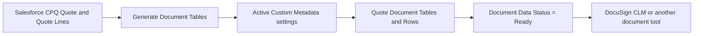

# How Quote Document Totals works

Quote Document Totals turns Salesforce CPQ Quote Lines into saved, checked tables for a customer document.

The person working on the Quote selects **Generate Document Tables**. Salesforce builds the tables, checks the totals, saves the rows, and changes **Document Data Status** to **Ready**. A document tool can then print the saved data.

## The whole process



In Salesforce:

1. Save the Quote and Quote Lines.
2. Select **Generate Document Tables**.
3. The Flow starts the Apex action.
4. Apex reads the active table settings.
5. Apex groups the Quote Lines, calculates the requested totals, and checks the results.
6. Salesforce saves Quote Document Table and Quote Document Row records.
7. The Quote shows **Document Data Status = Ready**.
8. A separate document action creates or sends the document.

Generating tables does not create, send, or sign a document.

## What appears on the Quote

| Quote field                              | Meaning                                                          | Next step                                                             |
| ---------------------------------------- | ---------------------------------------------------------------- | --------------------------------------------------------------------- |
| **Document Data Status = Not Generated** | Tables have not been built                                       | Select **Generate Document Tables**                                   |
| **Document Data Status = Stale**         | Relevant Quote data changed after the last successful generation | Generate again before creating a document                             |
| **Document Data Status = Ready**         | Every active table was built and passed its checks               | Review the tables or create the document                              |
| **Document Data Status = Failed**        | Salesforce found a setup or total problem                        | Read **Document Data Error**, correct the problem, and generate again |

Do not create a customer document when the status is Not Generated, Stale, or Failed.

## What Salesforce saves

Each successful run creates records related to the Quote:

```text
Quote
└── Quote Document Table       one record for each active table
    ├── Quote Document Column  the saved column order and headings
    ├── Quote Document Row     headings, details, subtotals, and totals
    └── Quote Document Block   approved text such as notes or instructions
```

Examples of a Quote Document Table are **Product Family Summary**, **Optional Products**, and **Annual Schedule**. Each table has its own ordered rows.

These records are the document data. The document tool should display them in order and should not calculate the totals again.

The next successful generation rebuilds the records from the current Quote Lines. Direct edits to generated records do not provide a lasting way to change the document.

## What controls each table

Custom Metadata holds the settings:

| Custom Metadata               | What it controls                                                                              |
| ----------------------------- | --------------------------------------------------------------------------------------------- |
| **Quote Document Table Def**  | Whether a table is active, which Quote Lines it includes, its title, and its overall behavior |
| **Quote Document Grouping**   | How Quote Lines are grouped, such as Product Family, Charge Type, Bundle, or Quote Line Group |
| **Quote Document Column Def** | Which saved fields appear as columns and the order of those columns                           |
| **Quote Document Key Value**  | Labels, translations, and approved lookup values                                              |
| **Quote Document Content**    | Notes, terms, assumptions, and other approved document wording                                |

Only active table definitions run. Turning a definition off removes that table the next time the Quote is generated.

Most table changes use Custom Metadata and do not need an Apex change. Examples include:

- Turn a table on or off.
- Change the table order.
- Include or exclude optional products.
- Group by an existing Quote Line, Product, Quote Line Group, or Quote field.
- Add another grouping level.
- Change a table title, column heading, label, or translation.
- Control whether detail rows or totals print.

Test every Custom Metadata change in a sandbox before production deployment.

## Tables and examples included

The project includes working settings and examples for common document needs, including:

- Product Family Summary
- Charge Type Summary
- Bundle Detail
- Quote Line Group and Product Family Detail
- Optional Products
- Family and Billing Frequency Summary
- Discount Summary
- Monthly and annual schedules
- Payment installments and milestones
- Product and bundle change summaries
- Customer product numbers
- Usage tiers and estimated consumption
- Cost allocations and separate purchasing entities

See [Available use cases](use-case/README.md) for the full list and the current test status of each example.

## How Salesforce protects the totals

Before a Quote is marked Ready, Salesforce checks that:

- each active table finished successfully;
- required table and row values are present;
- row order and group levels are valid;
- subtotals and totals agree with the rows that belong in them;
- the table that represents the full Quote agrees with the Salesforce CPQ Quote amount when that check applies; and
- no incomplete generation is presented as Ready.

If a check fails, the work is rolled back and **Document Data Status** becomes **Failed**. The error field explains the problem.

## When Apex is required

Custom Metadata can group and total existing Salesforce fields. An Apex change is needed only when the requested row cannot come from those settings, such as:

- a rounding adjustment;
- an approved estimated-tax row supplied by another process;
- a special discount row; or
- a value that must be calculated from rules rather than read from an existing field.

These changes use an approved Apex row adjustment named by `Row_Customizer_Code__c`. The code and Custom Metadata value must both be deployed and tested. Normal tables leave this field blank.

See [Apex row adjustment guide](use-case/43-registered-apex-row-adjustment.md) only when this type of change is required.

## Access and page setup

Assign the **CPQ Document Totals** permission set to anyone who needs to generate or review the saved tables.

On the Quote page, add:

- the **Generate Document Tables** action;
- **Document Data Status**;
- **Document Data Generated On**;
- **Document Data Error**; and
- the **Quote Document Tables** related list.

The permission set gives broad access to Quote Document Table and Quote Document Row records. Review the sharing needs of the org before assigning it broadly.

## Review the result

After generation:

1. Confirm **Document Data Status = Ready**.
2. Open the **Quote Document Tables** related list.
3. Open **Reports -> CPQ Document Totals**.
4. Choose the report for the table being checked.
5. Confirm headings, detail rows, subtotals, grand totals, and order.
6. Create a test document and compare it with the Salesforce report.

The Salesforce report and the document should show the same saved values.

## If something goes wrong

| What you see                         | What to do                                                                                            |
| ------------------------------------ | ----------------------------------------------------------------------------------------------------- |
| The action is missing                | Add **Generate Document Tables** to the Quote page layout and check Flow access                       |
| Access error                         | Assign the **CPQ Document Totals** permission set and review object and field access                  |
| Status is Failed                     | Read **Document Data Error**, correct the named Quote data or setting, and generate again             |
| Status is Stale                      | Save all Quote changes and generate again                                                             |
| A table is missing                   | Confirm its Quote Document Table Def record is active and deployed                                    |
| A group is missing                   | Check the grouping field on the Quote Lines and the Quote Document Grouping record                    |
| The document differs from the report | Make the document tool read the saved rows in display order and remove calculations from the template |

For field-by-field settings and detailed support checks, use the [setup and maintenance guide](quote-document-totals-architecture-guide.md).
