# CPQ Quote Document Totals - how the printed tables get built

## Start here

When a Quote goes out for signature, the PDF usually needs more than the one Net Amount on the CPQ Quote. It needs clear tables - for example money by Product Family, or a separate list of optional products.

**CPQ Quote Document Totals** builds those tables as Salesforce records on the Quote **before** DocuSign prints the PDF. DocuSign prints what is already there; it does not redo the math.

**Generate Document Tables** prepares the numbers in Salesforce. It does not send the PDF. DocuSign is a separate action afterward.

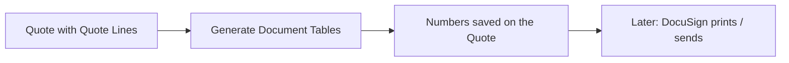

---

## Layer 1 - One Quote, two separate clicks

Quote **Q-00123** (Acme Manufacturing) already has Quote Lines saved in CPQ. Saving the Quote does **not** create document tables.

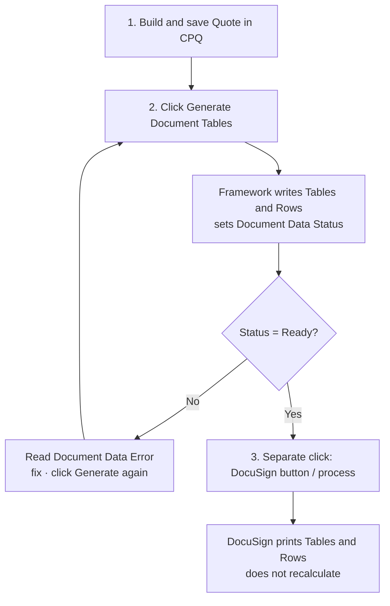

| Order | Action | What it does | What it does not do |
|---|---|---|---|
| 1 | Save Quote in CPQ | Stores Quote Lines | Does not build document tables |
| 2 | **Generate Document Tables** | Builds Tables/Rows, checks math, sets status | Does not open DocuSign, does not email a PDF |
| 3 | **DocuSign** (separate) | Prints / sends the PDF from those records | Does not recalculate totals |

| Document Data Status | Meaning | Next action |
|---|---|---|
| Not Generated | Never built | Click Generate |
| Stale | Quote changed after last successful build | Click Generate again |
| Ready | Build succeeded and checks passed | DocuSign |
| Failed | Last build failed and was undone | Read Document Data Error, fix, Generate again |

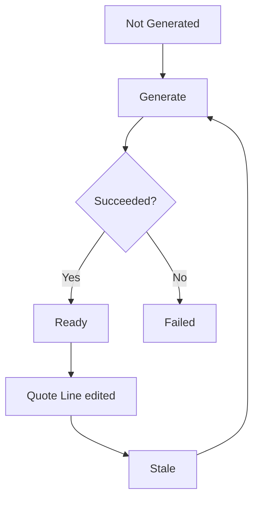

After a successful Generate, the Quote has related records:

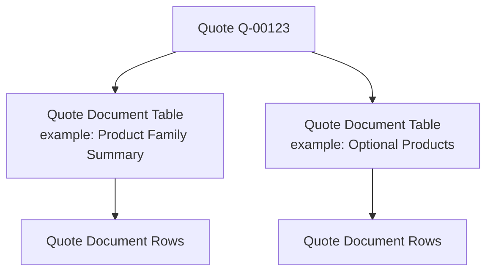

| Object | What it is |
|---|---|
| Quote Document Table | One printed table on that Quote |
| Quote Document Row | One line in that table (heading, Quote Line, subtotal, or Total) |

The next Generate deletes and rebuilds these from the current Quote Lines. Hand-edits do not last.

Access requires Permission Set **CPQ Document Totals**.

---

## Layer 2 - The four moving parts inside Generate

Generate is one click. Inside that click, four Salesforce mechanisms each have one job:

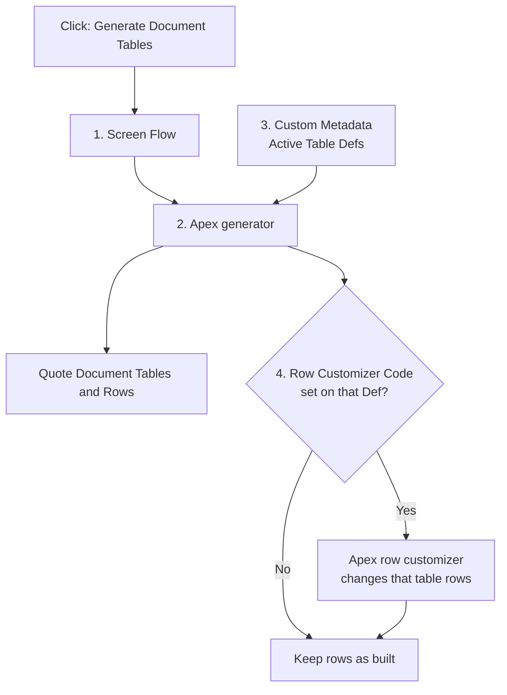

### Part 1 - Screen Flow (Generate Document Tables)

| | |
|---|---|
| **What it is** | A Screen Flow launched from a Quick Action on the Quote. |
| **Why it exists** | Salesforce needs a clickable entry point and a screen that shows success or failure. |
| **What it does** | Passes the Quote Id into Apex. Shows the message Apex returns. |
| **What it does not do** | Does not choose which tables to build. Does not filter Quote Lines. Does not create Quote Document Row records. Does not call DocuSign. |

**Example:** On Q-00123, click **Generate Document Tables**. The Flow runs, waits for Apex, then shows something like “tables generated” or an error. That is the entire Flow job.

**Why Flow is not used for the totals logic:** Totals must be the same whether someone clicks the button, runs a bulk backfill, or (later) another automation starts Generate. The arithmetic and table shape live in Apex + Custom Metadata so every entry point gets the same result. A Flow that created rows by hand would bypass the math checks and would be overwritten on the next Generate.

### Part 2 - Custom Metadata (the settings that decide *what* to build)

| | |
|---|---|
| **What it is** | Deployable settings records (not day-to-day Sales data). Main types: **Quote Document Table Def**, **Quote Document Grouping**, and optionally **Quote Document Key Value**. |
| **Why it exists** | So the org can turn tables on/off and change grouping without rewriting Apex for every new table shape. |
| **What it does** | Lists which table definitions are **Active**. For each Active Def, describes Line Filter, money columns, grouping fields, and optional customizer code. |
| **What it does not do** | Does not run when you click Generate by itself. Does not create Quote Document Table records until Apex reads it and runs. |

**Concrete example:**

| Custom Metadata record | Field | Value |
|---|---|---|
| Table Def | `Table_Code__c` | `PRODUCT_FAMILY_SUMMARY` |
| Table Def | `Is_Active__c` | true |
| Table Def | `Line_Filter__c` | `EXCLUDE_OPTIONAL` (= keep lines where `SBQQ__Optional__c` is false) |
| Grouping | `Field_Path__c` | `SBQQ__Product__r.Family` |
| Grouping | `Dimension__c` | blank |

Meaning in Salesforce terms: when Generate runs, Apex must build a table with Table Code `PRODUCT_FAMILY_SUMMARY`, keep non-optional Quote Lines (`SBQQ__Optional__c` is not true), and group them by Product Family (`SBQQ__Product__r.Family`).

**How which tables run is decided:**

1. Apex queries Custom Metadata for every Quote Document Table Def where `Is_Active__c = true`.
2. For each of those Defs, Apex creates exactly one Quote Document Table on the current Quote.
3. There is no picklist on the Quote that selects a subset.
4. Flow cannot override that list.
5. Apex cannot invent a table that has no Active Def (except by someone deploying a new Def / changing Is Active).

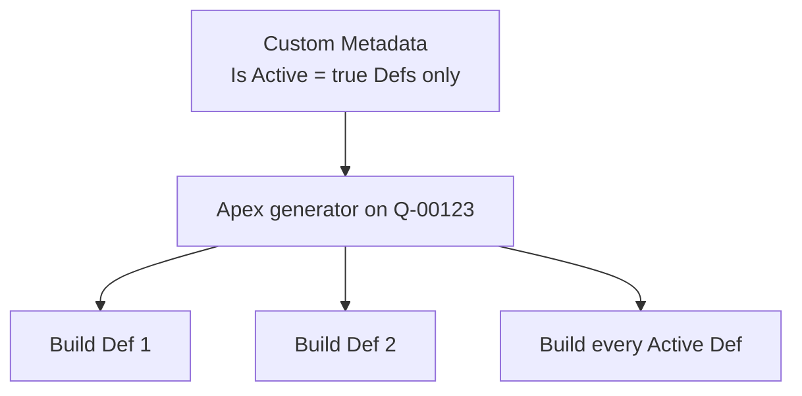

### Part 3 - Apex generator (the code that builds and checks)

| | |
|---|---|
| **What it is** | Apex classes centered on `QuoteDocumentGenerator` (plus helpers that read metadata, normalize Quote Lines, build rows, verify totals). |
| **Why it exists** | Building nested headings/subtotals, applying filters, and proving the math is beyond what a Screen Flow should own. |
| **What it does** | Reads the Quote + Quote Lines. Reads Active Custom Metadata. For each Active Def: filters lines, groups them, creates Table + Rows, runs safety checks, sets Document Data Status to Ready or Failed. |
| **What it does not do** | Does not decide the menu of tables (Custom Metadata does). Does not show the UI button (Flow does). Does not send DocuSign. |

**Example:** For Active Def `PRODUCT_FAMILY_SUMMARY`, the generator drops optional lines, groups by `SBQQ__Product__r.Family`, writes Group Header / Detail / Subtotal / Grand Total rows, checks that totals reconcile, then marks the Quote Ready if every table passed.

### Part 4 - Apex row customizer (optional extra logic on one Def)

| | |
|---|---|
| **What it is** | A separate Apex class registered under a short code (example: `INDUSTRY_ALLEGIANCE`). The Table Def field `Row_Customizer_Code__c` stores that code. |
| **Why it exists** | Some rules cannot be expressed as Line Filter + group-by-field. Example: “after Industry totals exist, if a group totals zero, move it to Other.” |
| **What it does** | Runs **after** the generator has already built that table’s rows. May add, remove, or rebuild rows for **that table only**. The table must still pass the same math checks afterward. |
| **What it does not do** | Does not turn the table on (that is `Is_Active__c`). Does not run for Defs where `Row_Customizer_Code__c` is blank. Does not replace Custom Metadata as the source of which tables exist. |

**Example:** Def `INDUSTRY_ALLEGIANCE` is Active and has `Row_Customizer_Code__c = INDUSTRY_ALLEGIANCE`. Key Value Custom Metadata maps Product Name → Industry. The customizer re-buckets rows using those maps and the zero-total rule. Without the code on the Def, that Apex never runs.

### Side-by-side (same four parts, no overlap)

| Part | Chooses which tables exist on Generate? | Builds the rows? | Holds filter/group settings? | Starts when someone clicks the button? |
|---|---|---|---|---|
| Custom Metadata | **Yes** (`Is_Active__c`) | No | **Yes** | No |
| Screen Flow | No | No | No | **Yes** |
| Apex generator | No (reads Active Defs) | **Yes** (normal build) | No (reads them) | Called by Flow |
| Apex row customizer | No | **Only if** Def has a code; after normal build | No | Called by generator when code is set |

Related pieces (objects, permission set, reports) are listed in **Appendix F**.

---

## Layer 3 - What one Table Def contains

Layer 2 said Custom Metadata chooses tables. This layer is the shape of one Def.

A Table Def is more than Line Filter + Grouping.

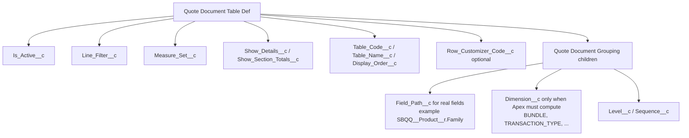

| Metadata type | Holds |
|---|---|
| Quote Document Table Def | On/off, Table Code, Line Filter, measure set, show flags, optional customizer code |
| Quote Document Grouping | How to bucket lines, plus Level/Sequence |

**Line Filter vs Field Path:** Grouping can name a real field (`Field_Path__c`). Line Filter today is a **named inclusion rule** on the Table Def (`Line_Filter__c`), not a free field path. Several rules map to CPQ fields; one does not (`BUNDLE_PARENTS_ONLY`). See Appendix B.

| `Line_Filter__c` value | Salesforce meaning |
|---|---|
| `ALL` | Every Quote Line |
| `EXCLUDE_OPTIONAL` | `SBQQ__Optional__c` is not true |
| `OPTIONAL_ONLY` | `SBQQ__Optional__c` is true |
| `RECURRING_ONLY` | `SBQQ__ChargeType__c` = Recurring |
| `ONE_TIME_ONLY` | `SBQQ__ChargeType__c` is not Recurring |
| `BUNDLE_PARENTS_ONLY` | Package parent or non-component line (computed - not one field) |

**Grouping rule:**

| Situation | What to set | What to leave blank |
|---|---|---|
| The bucket is a real field on Quote Line / Product / Quote Line Group / related record | `Field_Path__c` (example `SBQQ__Product__r.Family`) | `Dimension__c` |
| The bucket is **computed by Apex** and is not one field (bundle parent name, amendment transaction type, and similar) | `Dimension__c` | `Field_Path__c` |

Never set both. Never leave both blank.

**Why Dimension exists at all (and why not delete it):** several shipped groupings cannot be written as a single Field Path. `BUNDLE` walks package / component relationships. `TRANSACTION_TYPE` comes from classification logic. Those are not `Something__r.Field__c`. For ordinary fields like Product Family, **do not use Dimension** - use `Field_Path__c = SBQQ__Product__r.Family` so every setting is an actual Salesforce field path.

If the need is only “filter these lines” and “group by this field,” stay on Custom Metadata (Parts 2 + 3) with **Field Path**. If the need requires group totals first or invents rows that are not Quote Lines, keep the Def Active and add Part 4 (row customizer).

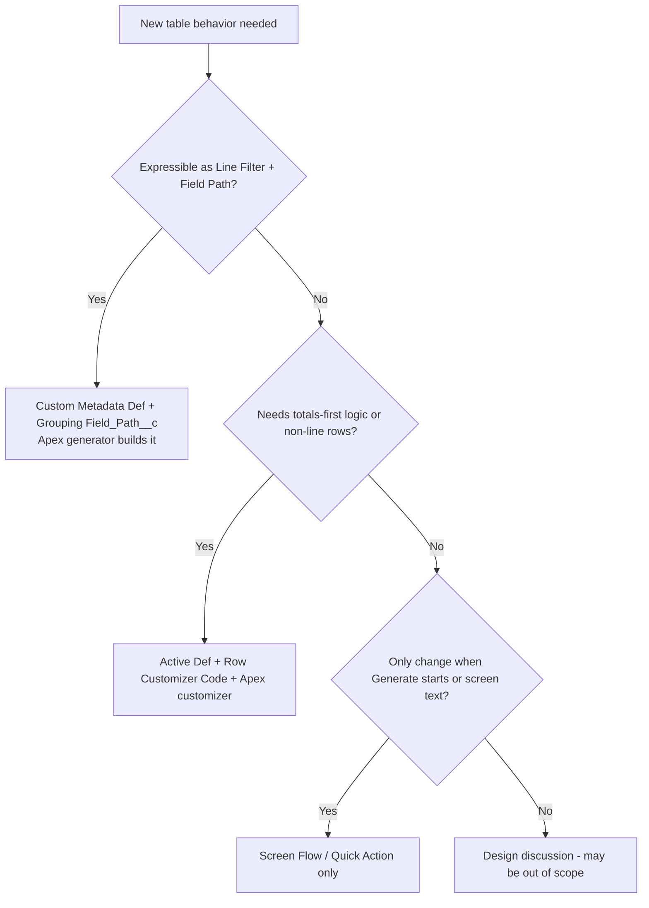

---

## Layer 4 - Three Table Def examples (what gets configured)

This layer answers one question only: **what must exist in Custom Metadata (and optionally Apex) before Generate can build each kind of table?**

Printed row results for the same Quote are in Layer 6. Here: one Quote (Q-00123), one Generate click, three Active Table Defs.

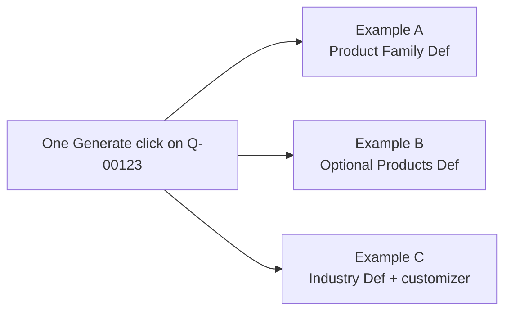

Examples A and B use Custom Metadata + the Apex generator only. Example C also uses a row customizer, because the rule needs Industry totals that do not exist yet at normal grouping time. The Screen Flow is the same in all three - it only starts Generate.

---

### Example A - Product Family summary (Custom Metadata only)

#### What the business is asking for

The customer PDF needs a table that shows how much money sits in each **Product Family** (Hardware, Software, Services, and so on). Optional products should **not** appear here, because the Quote Net Amount that customers usually sign to also excludes optional products. So this table should line up with that idea of “the deal without optionals.”

Nobody is asking for Industry remapping or special rounding lines. The Product already has a **Family** field in Salesforce. So the Grouping should name that field directly with `Field_Path__c` - not a parallel Dimension nickname.

#### What Generate does with this Def

1. Apex sees `Is_Active__c = true` on Table Def `PRODUCT_FAMILY_SUMMARY`, so this table is on the menu for Q-00123.
2. Apex applies `Line_Filter__c = EXCLUDE_OPTIONAL`, which means keep Quote Lines where `SBQQ__Optional__c` is not true. Optional lines are ignored for this table only.
3. Apex reads the Grouping child: `Field_Path__c = SBQQ__Product__r.Family` and `Dimension__c` blank.
4. That path is the same relationship you would use in a Salesforce report: Quote Line → Product → Family.
5. Apex builds one Quote Document Table with `Table_Code__c = PRODUCT_FAMILY_SUMMARY`, plus the heading / subtotal / total rows for each Family value.
6. No row customizer runs, because `Row_Customizer_Code__c` is blank.
7. Flow did not choose this table. Flow only started the run.

#### Flowchart - configuration to table

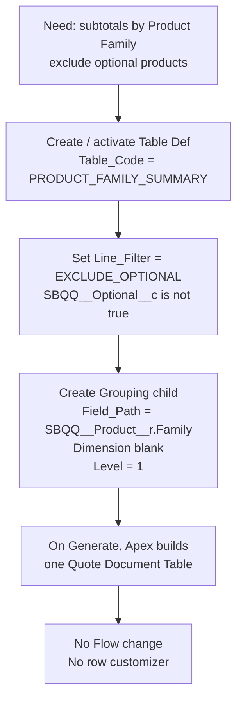

#### Why not Dimension here?

`Dimension__c = PRODUCT_FAMILY` would resolve to the same Product Family field, but it adds a second way to say the same thing. For any grouping that is a real field, set **only** `Field_Path__c`. Reserve `Dimension__c` for computed cases such as `BUNDLE` or `TRANSACTION_TYPE` (see Appendix B).

#### Settings

**Quote Document Table Def**

| Field (API name) | Value | Meaning |
|---|---|---|
| `Table_Code__c` | `PRODUCT_FAMILY_SUMMARY` | Stable ID for DocuSign and reports. Do not rename after templates depend on it. |
| `Table_Name__c` | Product Family Summary | Friendly name on the generated table |
| `Is_Active__c` | true | Include this Def whenever Generate runs |
| `Line_Filter__c` | `EXCLUDE_OPTIONAL` | Keep Quote Lines where `SBQQ__Optional__c` is not true |
| `Measure_Set__c` | `PRICE_WATERFALL` | Standard List / Regular / Discount / Net style columns |
| `Show_Details__c` | false | Shipped Def shows headings and subtotals; details can be turned on if needed |
| `Row_Customizer_Code__c` | blank | No Apex customizer for this Def |

**Quote Document Grouping** (one child of that Def)

| Field (API name) | Value | Meaning |
|---|---|---|
| `Table_Definition__c` | `PRODUCT_FAMILY_SUMMARY` | Must match the Def’s `Table_Code__c` exactly |
| `Field_Path__c` | `SBQQ__Product__r.Family` | Group by Product Family on the Quote Line’s Product |
| `Dimension__c` | blank | Blank because this is a real field path |
| `Level__c` | 1 | Top-level group |
| `Sequence__c` | 10 | Order if multiple parts share a Level |

**Parts used:** Custom Metadata + Apex generator. **Parts not used:** Flow logic, row customizer.

### Example B - Optional Products only (Custom Metadata only)

#### What the business is asking for

Optional products still matter on the PDF - often in a separate “options” section - but they must not be mixed into the main Product Family total from Example A. So the org needs a **second** Table Def whose Line Filter keeps only optional Quote Lines, still broken out by Product Family so the PDF is readable.

This is still a Custom Metadata job. The only large difference from Example A is `Line_Filter__c`.

#### What Generate does with this Def

1. Apex sees a second Active Def: `OPTIONAL_PRODUCTS`.
2. On the **same** Generate as Example A, Apex also builds this table. One click, two Defs, two Quote Document Tables.
3. `Line_Filter__c = OPTIONAL_ONLY` means keep Quote Lines where `SBQQ__Optional__c` is true (Extended Warranty-type lines) and drop the rest for this table only.
4. Grouping is again `Field_Path__c = SBQQ__Product__r.Family` (`Dimension__c` blank).
5. `Show_Details__c = true` so each optional Quote Line can print, not only a Family subtotal.
6. A line that was excluded from Example A can appear here. That is intentional: filters are per table, not a permanent label on the Quote Line.
7. Still no row customizer. Still no Flow decision about “run A but skip B.” Both run because both are Active.

#### Flowchart - second Def beside the first

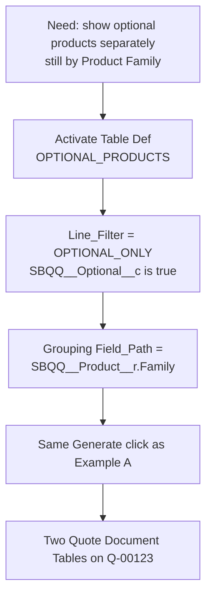

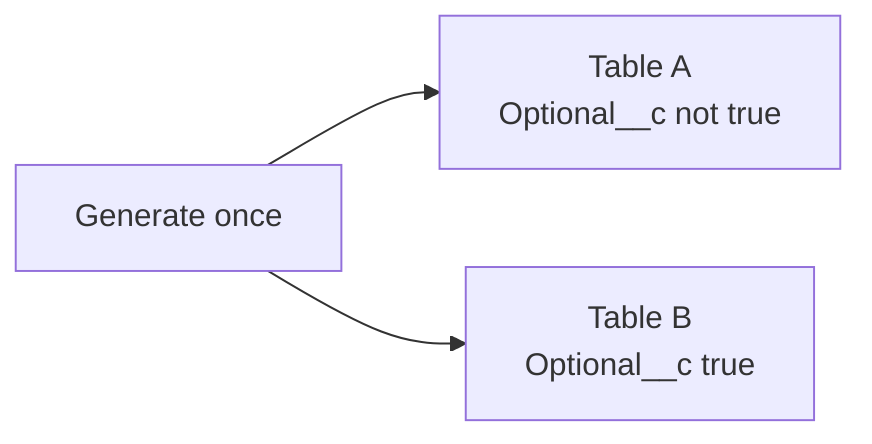

#### Settings

**Quote Document Table Def**

| Field (API name) | Value | Meaning |
|---|---|---|
| `Table_Code__c` | `OPTIONAL_PRODUCTS` | Second stable table code |
| `Table_Name__c` | Optional Products | Friendly name |
| `Is_Active__c` | true | Built on every Generate along with other Active Defs |
| `Line_Filter__c` | `OPTIONAL_ONLY` | Keep Quote Lines where `SBQQ__Optional__c` is true |
| `Measure_Set__c` | `PRICE_WATERFALL` | Same money column family as Example A |
| `Show_Details__c` | true | Print each optional Quote Line |
| `Row_Customizer_Code__c` | blank | No customizer |

**Quote Document Grouping**

| Field (API name) | Value | Meaning |
|---|---|---|
| `Table_Definition__c` | `OPTIONAL_PRODUCTS` | Links grouping to this Def |
| `Field_Path__c` | `SBQQ__Product__r.Family` | Same Product Family field as Example A |
| `Dimension__c` | blank | Blank - real field path |
| `Level__c` | 1 | |
| `Sequence__c` | 10 | |

**Other Field Path ideas** if Family is not the right breakout:

| `Field_Path__c` | Groups by |
|---|---|
| `SBQQ__Product__r.Family` | Product Family |
| `SBQQ__ChargeType__c` | Charge Type on the Quote Line |
| `SBQQ__Group__r.Name` | Quote Line Group name |
| `SBQQ__Group__r.SBQQ__BillingFrequency__c` | Billing Frequency on the Quote Line Group |

**Parts used:** Custom Metadata + Apex generator.

---

### Example C - Industry buckets (Custom Metadata + Apex row customizer)

#### What the business is asking for

The PDF needs totals by **Industry** bucket, not by Product Family. Products are mapped to Industry names (for example Implementation Services → Professional Services). Products with no mapping go to **Other**. After each Industry is totaled, if that Industry’s net amount is **zero**, the whole group should move into Other so empty Industry labels do not clutter the document. Optionally, very large Industry totals can move into a **Key Accounts** bucket.

#### Why Custom Metadata Grouping alone cannot finish this

Normal Grouping runs **while** lines are being sorted into buckets, **before** each bucket’s total exists. The rule “if this Industry totals zero, fold it into Other” needs the total first. That is exactly why this Def keeps Custom Metadata for “table is Active” and “which customizer to run,” and uses an Apex row customizer for the remapping after the first build.

#### What Generate does with this Def

1. Apex sees the Industry Table Def is Active, so the table is on the menu.
2. Apex builds a first pass of rows from the Def’s normal Grouping (the Def still needs a Grouping record; the customizer later replaces the business-facing buckets).
3. Because `Row_Customizer_Code__c` is set (example `INDUSTRY_ALLEGIANCE`), Apex runs that customizer next.
4. The customizer reads **Quote Document Key Value** rows (Category such as Industry Map): Product Name → Industry Name.
5. Unmapped products go to Other. Each Industry is totaled. Zero-total Industries move to Other. Optional large totals can move to Key Accounts.
6. Headers and subtotals are rebuilt. Grand Total stays consistent with counted lines so math checks can still pass.
7. Flow still did not choose this table. `Is_Active__c` did. The customizer only ran because the code was on the Def.

#### Flowchart - what must be configured

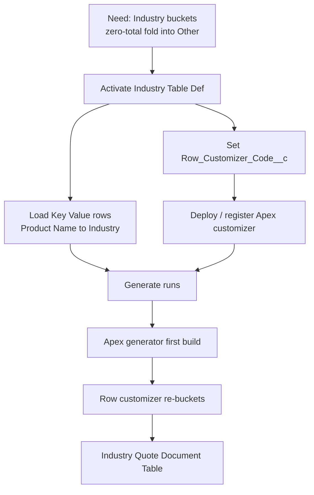

#### Flowchart - customizer decision logic

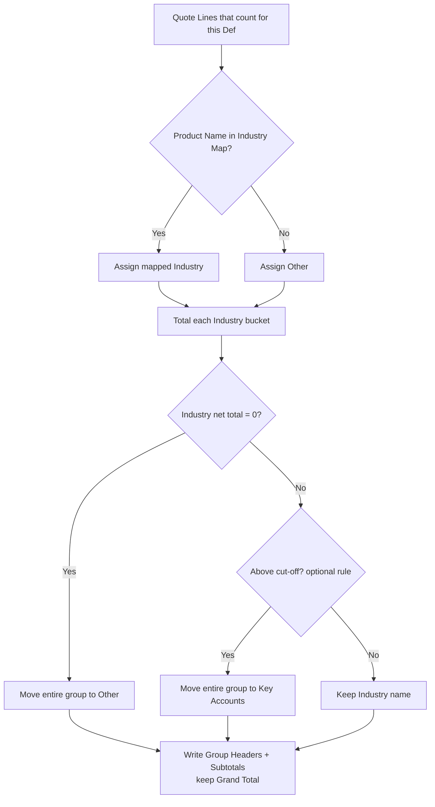

#### Settings

**Quote Document Table Def (conceptual)**

| Field (API name) | Value | Meaning |
|---|---|---|
| `Table_Code__c` | e.g. `INDUSTRY_ALLEGIANCE` | Stable code DocuSign will filter on |
| `Is_Active__c` | true | Puts this table on every Generate |
| `Line_Filter__c` | usually `EXCLUDE_OPTIONAL` | Same as Example A: `SBQQ__Optional__c` is not true |
| `Measure_Set__c` | `PRICE_WATERFALL` | Required for the sample customizer’s net-total logic |
| `Show_Details__c` | false | Sample customizer rebuilds headers/subtotals, not every Detail line |
| `Row_Customizer_Code__c` | e.g. `INDUSTRY_ALLEGIANCE` | Exact code registered to the Apex class |

**Quote Document Key Value** (many rows; one shown)

| Field (API name) | Example value | Meaning |
|---|---|---|
| `Category__c` | Industry Map | Which lookup list this row belongs to |
| `Key__c` | Implementation Services | Product Name |
| `Value__c` | Professional Services | Industry bucket name |

**Parts used:** Custom Metadata (Def + Key Value) + Apex generator + Apex row customizer. **Flow:** start Generate only.

---

## Layer 5 - How rows are built (one path for every Def)

Every Active Def from Layer 4 is processed with the same steps. The only fork is “does this Def have a Row Customizer Code?”

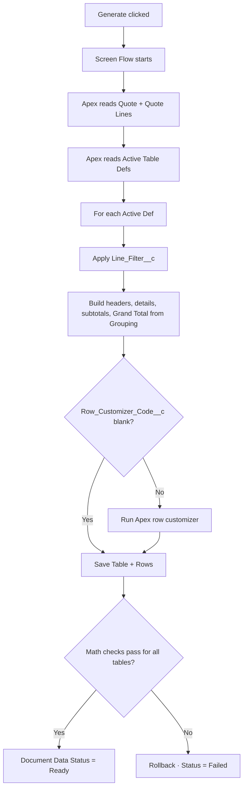

| Step | Which part | What happens |
|---|---|---|
| Click | Screen Flow | Starts the run; later shows success or failure |
| Read metadata | Custom Metadata | Supplies every Active Def and its Groupings |
| Filter / group / insert | Apex generator | Creates each Quote Document Table and its Rows |
| Optional reshape | Apex row customizer | Only Example C-style Defs with a code |
| Ready / Failed | Apex generator | Entire Quote succeeds together or rolls back together |

---

## Layer 6 - Same Quote Lines, three printed results

Layer 4 was configuration. Layer 5 was the shared engine path. This layer shows **what the rows look like** for Q-00123 when Examples A, B, and C are all Active.

#### Shared Quote Lines

| Line | Product | Family (`SBQQ__Product__r.Family`) | Net | Optional? | Industry map |
|---|---|---|---|---|---|
| 1 | Laptop Pro | Hardware | 1800 | No | not mapped → Other in Example C |
| 2 | Docking Station | Hardware | 72 | No | not mapped → Other in Example C |
| 3 | Extended Warranty | Services | 300 | Yes | ignored by A and C if filter excludes optional |
| 4 | Implementation Services | Services or similar | 24000 | No | mapped → Professional Services |

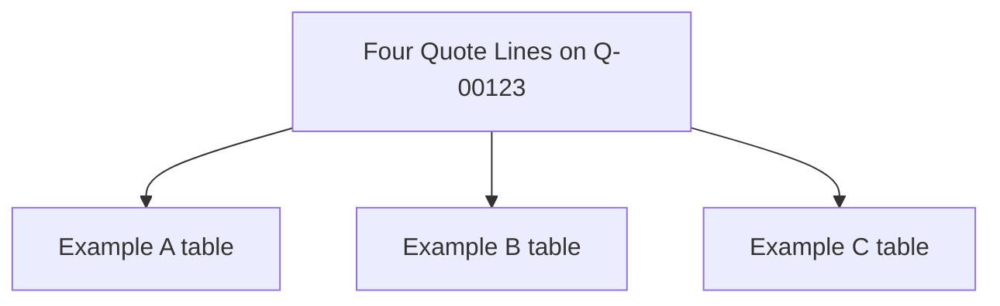

---

### Rows from Example A

Start with all four lines. Apply `EXCLUDE_OPTIONAL` → Extended Warranty drops out. Group the remaining lines by Product Family. Laptop Pro and Docking Station share Hardware, so they land under one Hardware heading. Implementation Services lands under whatever Family is on that Product. Apex writes headings, lines (if Show Details is true), subtotals, and a Grand Total. No customizer runs.

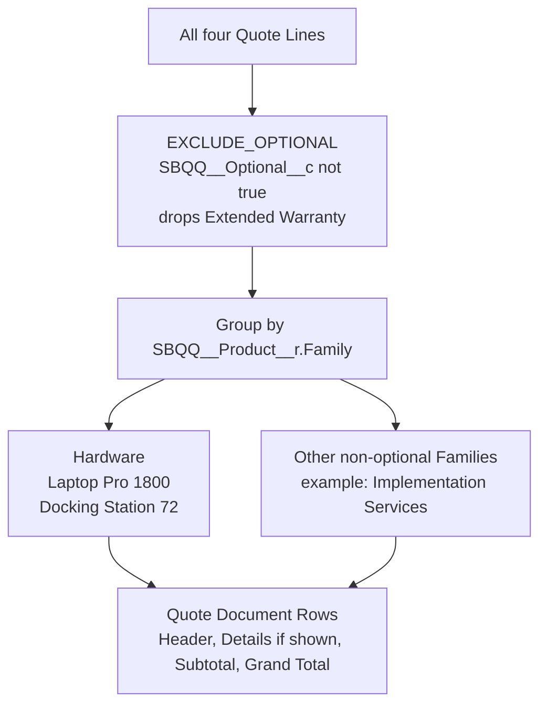

**Printed shape (simplified)**

```
Product Family Summary
  Hardware
    Laptop Pro              1800
    Docking Station           72
    Hardware Subtotal       1872
  ... other families ...
  Total                     ...
```

#### Field reminder for this result

| Setting that caused this | Value |
|---|---|
| `Line_Filter__c` | `EXCLUDE_OPTIONAL` (`SBQQ__Optional__c` not true) |
| Grouping | `Field_Path__c = SBQQ__Product__r.Family` |
| Customizer | none |

---

### Rows from Example B

Same four lines, same Generate, different Def. `OPTIONAL_ONLY` keeps Extended Warranty and drops the other three for this table. Family is still Services for that product, so one Services bucket appears. Because Show Details is true, the warranty prints as its own Detail row.

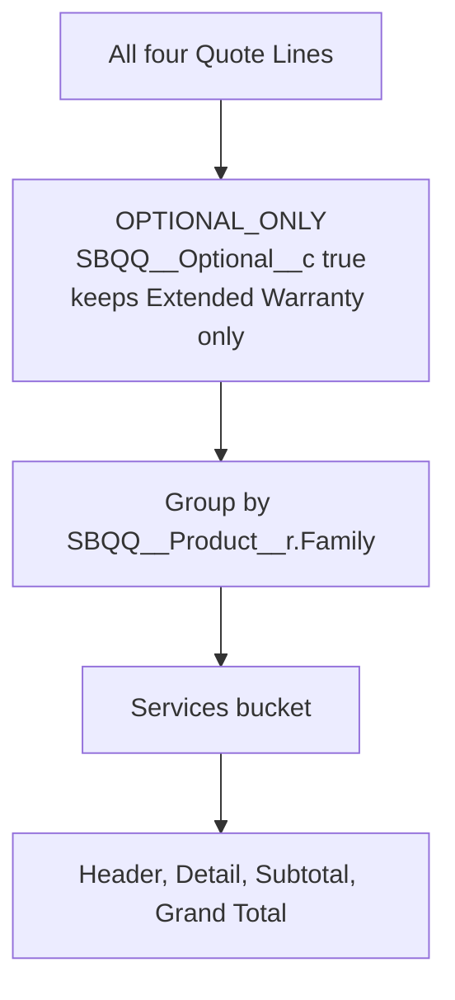

**Printed shape**

```
Optional Products
  Services
    Extended Warranty        300
    Services Subtotal        300
  Total                      300
```

#### Field reminder for this result

| Setting that caused this | Value |
|---|---|
| `Line_Filter__c` | `OPTIONAL_ONLY` (`SBQQ__Optional__c` true) |
| Grouping | `Field_Path__c = SBQQ__Product__r.Family` |
| Why warranty appeared here but not in A | Different Line Filter on a different Active Def |

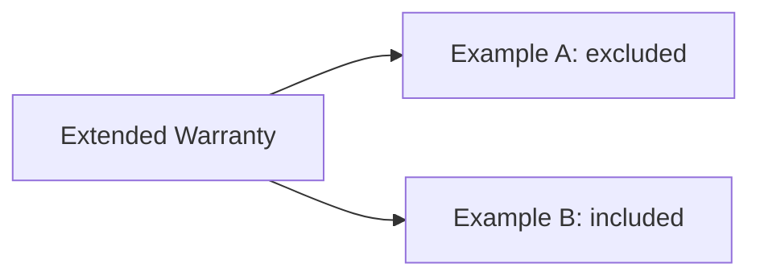

---

### Rows from Example C

Optional lines are typically excluded again (`EXCLUDE_OPTIONAL`). Remaining products are mapped through Key Value metadata. Implementation Services becomes Professional Services. Laptop Pro and Docking Station have no map, so they start in Other. Each Industry bucket is totaled. If a bucket’s net is zero, that whole bucket moves to Other. Optional Key Accounts rule can move oversized buckets. Headers/subtotals are rewritten; Grand Total still matches the counted money so Ready can be set.

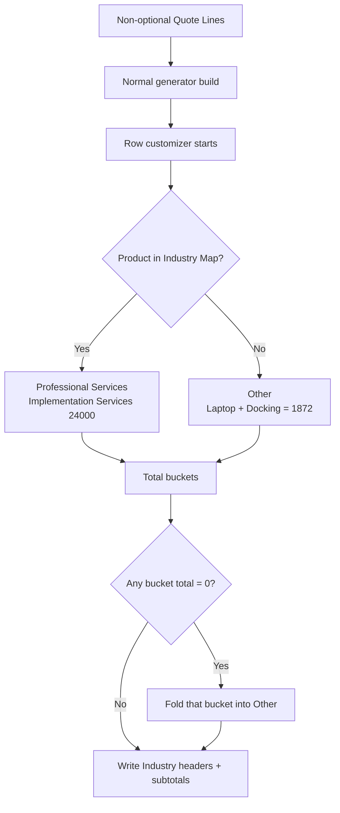

**Printed shape (simplified)**

```
Industry table
  Other                     1872
  Professional Services    24000
  Total                    25872
```

Numbers above are illustrative for these four lines; real orgs use their own maps and filters.

#### Field reminder for this result

| Setting that caused this | Value |
|---|---|
| Table Def Active | true |
| `Row_Customizer_Code__c` | Industry customizer code |
| Key Value map | Product Name → Industry |
| Why Apex was required | Zero-total fold needs totals before final buckets |

---

## Appendix - reference only

Field lookups and upgrade notes.

### A. Row types

| Row Type | Meaning | Produced by |
|---|---|---|
| Group Header | Section title | Apex generator from Grouping |
| Detail | One Quote Line | Apex generator when Show Details is true |
| Subtotal | Group total | Apex generator |
| Section Total | Extra cut when configured | Apex generator |
| Grand Total | Table total, always last | Apex generator |
| Informational / Discount / Rounding / Note | Non-standard lines | Apex row customizer only |

### B. Grouping: prefer Field Path; Dimension only when computed

**Default for new tables:** set `Field_Path__c` to the real Salesforce field path. Leave `Dimension__c` blank.

| Example `Field_Path__c` | Groups by |
|---|---|
| `SBQQ__Product__r.Family` | Product Family |
| `SBQQ__ChargeType__c` | Charge Type on the Quote Line |
| `SBQQ__Group__r.Name` | Quote Line Group name |
| `SBQQ__Group__r.SBQQ__BillingFrequency__c` | Billing Frequency on the Quote Line Group |
| `SBQQ__Quote__r.AccountIndustry__c` | Account Industry on the Quote (same value for every line) |

**Use `Dimension__c` only when there is no single field to point at** (Apex computes the bucket):

| `Dimension__c` | Why it is not a Field Path |
|---|---|
| `BUNDLE` | Package vs component vs standalone logic - not one field |
| `TRANSACTION_TYPE` | Amendment/renewal classification logic - not one field |

Some older shipped Defs still use Dimension shortcuts that map to fields (for example `PRODUCT_FAMILY` → `SBQQ__Product__r.Family`). That works, but it is the duplicate path this guide avoids for new configuration. Prefer Field Path so each grouping row names the actual field.

Set exactly one of `Dimension__c` or `Field_Path__c`, never both, never neither.

### B2. Line Filter codes and the CPQ fields they mean

`Line_Filter__c` is a fixed list of inclusion rules (same idea as CPQ Template Section filters), not a Field Path. Read the **Salesforce meaning** column; the code is what goes in metadata.

| `Line_Filter__c` | Salesforce meaning | Why it is not a Field Path today |
|---|---|---|
| `ALL` | Every Quote Line | No field predicate |
| `EXCLUDE_OPTIONAL` | `SBQQ__Optional__c` is not true | Could be expressed as a field test; shipped as a named rule |
| `OPTIONAL_ONLY` | `SBQQ__Optional__c` is true | Same |
| `RECURRING_ONLY` | `SBQQ__ChargeType__c` = Recurring | Named rule over Charge Type |
| `ONE_TIME_ONLY` | `SBQQ__ChargeType__c` is not Recurring | Includes blank Charge Type as one-time |
| `BUNDLE_PARENTS_ONLY` | Package parent, or a line that is not a bundled component | Computed from bundle relationships - not one field |

So Field Path answers “group by which field?” Line Filter answers “which lines are allowed into this table?” Some filters line up with one checkbox or picklist; `BUNDLE_PARENTS_ONLY` does not.

### C. Industry setup order

```mermaid
flowchart TD
    A["Agree Industry names + Other"] --> B["Load Product to Industry Key Values"]
    B --> C["Activate Def + Row Customizer Code"]
    C --> D["Assign CPQ Document Totals"]
    D --> E["Generate · confirm Ready"]
    E --> F["Point DocuSign at Table Code"]
```

### D. Framework updates later

| Layer | Contents | Across upgrades |
|---|---|---|
| Core | Generator, checks, objects, metadata types, base Flow | Take updates from this project |
| Org settings | Active Defs, Key Value maps, reports, DocuSign, layouts | Keep and merge |
| Org Apex extras | Row customizers | Keep outside shared generator edits |

### E. Terms

| Term | Meaning |
|---|---|
| Framework | This whole set of objects, metadata, Apex, Flow, permission set, reports |
| Table Def | Quote Document Table Def Custom Metadata (`Is_Active__c` controls whether it runs) |
| Generate | Quick Action / Screen Flow that calls the Apex generator |
| Apex generator | Builds Tables/Rows from Active Defs and checks math |
| Row customizer | Optional Apex for one Def after the normal build |
| DocuSign action | Separate from Generate; prints/sends the PDF |

---

### F. Full list of framework pieces (reference)


| Piece | Salesforce type | Job |
|---|---|---|
| Quote Document Table / Row | Custom Objects | Store the printable totals under a Quote |
| Quote Document Table Def / Grouping / Key Value | Custom Metadata | Settings for *which* tables to build and *how* |
| Generate Document Tables | Screen Flow + Quick Action | The click that starts a build |
| QuoteDocumentGenerator (and helpers) | Apex | Perform the build and the math checks |
| Row customizer (optional) | Apex | Extra logic for one table after the normal build |
| CPQ Document Totals | Permission Set | Access to generate and view the objects |
| CPQ Document Totals reports | Reports | Review numbers without opening every related list |

---

## Cheat sheet

| Question | Exact answer |
|---|---|
| Is this a framework? | Yes |
| Does Generate send DocuSign? | No |
| What chooses which tables get built? | Custom Metadata Table Defs with `Is_Active__c = true` only |
| What does the Screen Flow do? | Starts Generate and shows the result message |
| What does the Apex generator do? | Reads Active Defs, builds Tables/Rows, checks math, sets Ready/Failed |
| When does a row customizer run? | Only when that Def has `Row_Customizer_Code__c` filled in |
| Can Flow create the totals? | No - not supported; would bypass checks and fight the next Generate |
| Everyday new table? | New Active Table Def + Grouping Custom Metadata |
| Industry zero-total fold-in? | Active Def + Key Value map + Apex row customizer |
