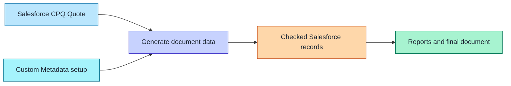
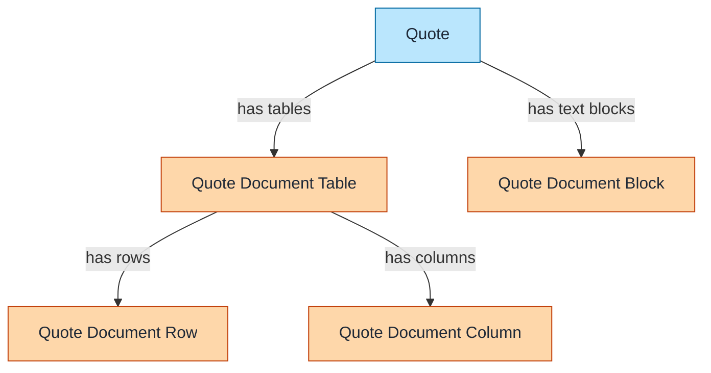
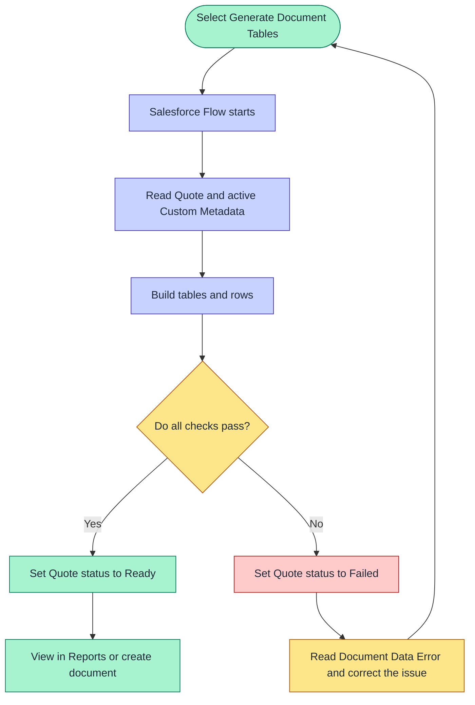

# Quote document architecture — simple view

This feature does one simple job:

> It reads a Salesforce CPQ Quote, organizes the Quote Lines using Custom Metadata, checks the totals, and saves document-ready records.

The document and Salesforce Reports use those saved records. They do not calculate the Quote again.

## 1. The whole process

### Mermaid diagram



### Text-only version

```text
Salesforce CPQ Quote ───┐
                        ├──> Generate ──> Checked records ──> Reports/document
Custom Metadata setup ──┘
```

- The **Quote** supplies products, quantities, prices, dates, and Quote Line Groups.
- **Custom Metadata** says which tables to create and how to organize them.
- **Generate** builds the tables and checks their totals.
- The checked records become the source for Reports and the final document.

## 2. The saved data model

### Mermaid diagram



### Text-only version

```text
Quote
├── Quote Document Table
│   ├── Quote Document Rows
│   └── Quote Document Columns
└── Quote Document Blocks
```

The easiest way to remember the model is:

- A **Quote Document Table** is one complete table, such as Product Family Summary.
- A **Quote Document Row** is one heading, product line, subtotal, or grand total.
- A **Quote Document Column** says which saved columns the table displays.
- A **Quote Document Block** is document text, such as assumptions or signature instructions.

## 3. What happens after Generate is selected

### Mermaid diagram



### Text-only version

```text
Select Generate
      │
      ▼
Flow reads the Quote and Custom Metadata
      │
      ▼
Salesforce builds and checks the tables
      │
      ├── Checks pass ──> Ready ──> Reports or final document
      │
      └── Check fails ──> Failed ──> Correct the error and try again
```

Nothing is ready for a document until all checks pass.

## Quote status meanings

| Status            | Meaning                                              | What to do                                                           |
| ----------------- | ---------------------------------------------------- | -------------------------------------------------------------------- |
| **Not Generated** | No saved document data exists yet.                   | Select **Generate Document Tables**.                                 |
| **Stale**         | The Quote changed after document data was generated. | Generate again.                                                      |
| **Generating**    | Salesforce is currently building the records.        | Wait for completion.                                                 |
| **Ready**         | The records were created and all checks passed.      | Review or create the document.                                       |
| **Failed**        | Salesforce could not create a valid result.          | Read **Document Data Error**, correct the cause, and generate again. |

## Simple example

A Quote contains:

- Software: $10,000
- Services: $5,000

The Product Family Summary setup tells Salesforce to group the Quote Lines by Product Family.

After Generate is selected, Salesforce saves:

```text
Quote Document Table: Product Family Summary
├── Row: Software       $10,000
├── Row: Services        $5,000
└── Row: Grand Total    $15,000
```

The related list, Salesforce Report, and final document all read the same saved $15,000 total.

## Exact Salesforce component names

These names are provided only when the exact component must be found in Setup or source control.

| Plain name       | Salesforce component               |
| ---------------- | ---------------------------------- |
| Quote            | `SBQQ__Quote__c`                   |
| Quote Line       | `SBQQ__QuoteLine__c`               |
| Table setup      | `Quote_Document_Table_Def__mdt`    |
| Grouping setup   | `Quote_Document_Grouping__mdt`     |
| Column setup     | `Quote_Document_Column_Def__mdt`   |
| Saved table      | `Quote_Document_Table__c`          |
| Saved row        | `Quote_Document_Row__c`            |
| Saved column     | `Quote_Document_Column__c`         |
| Saved text block | `Quote_Document_Block__c`          |
| Generate Flow    | **Generate Quote Document Tables** |
| Quote action     | **Generate Document Tables**       |

## Key rule

The final document prints saved Salesforce values. It must not calculate prices, discounts, subtotals, or grand totals on its own.

Live-org page layouts and document-tool screens are not shown because they vary by Salesforce org. The numbered runbooks give the exact Salesforce configuration and verification steps for each supported use case.
